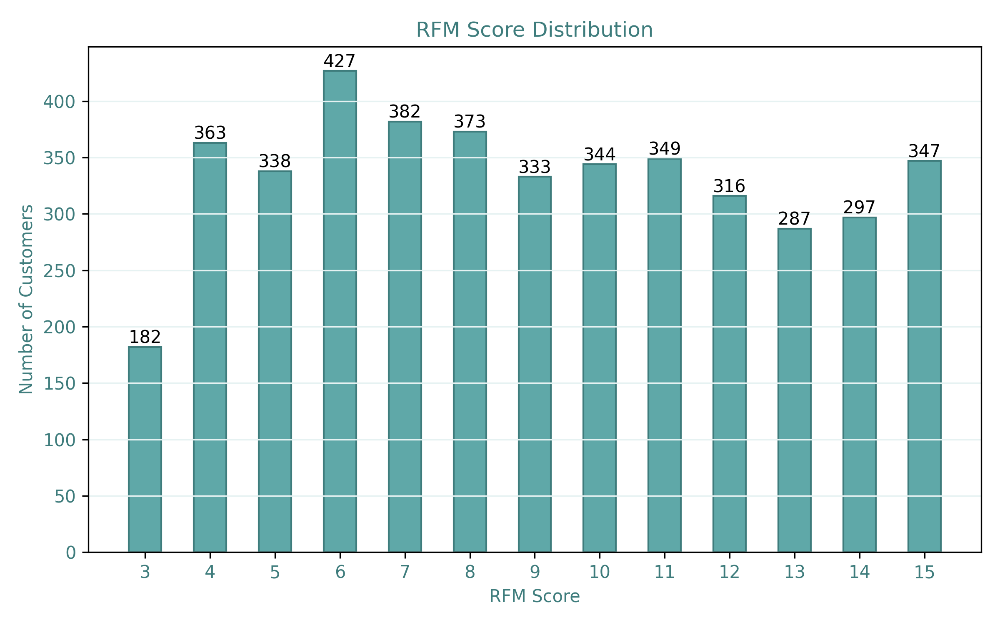
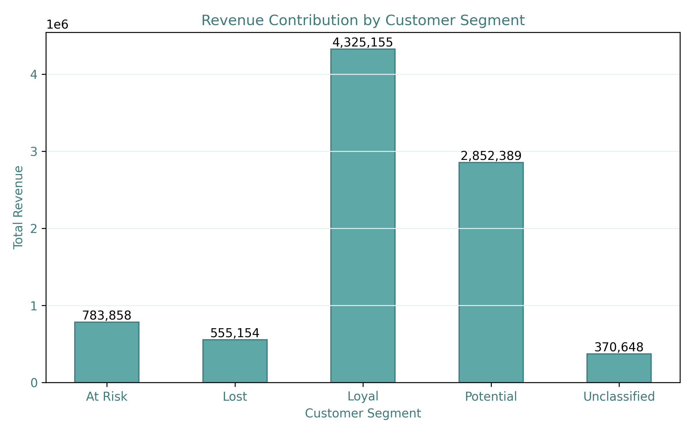
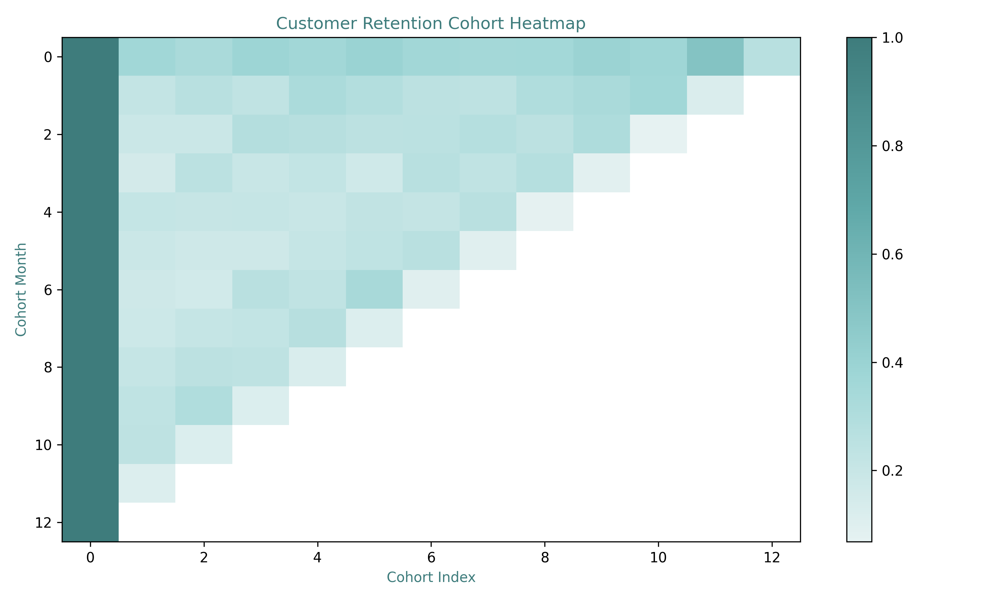
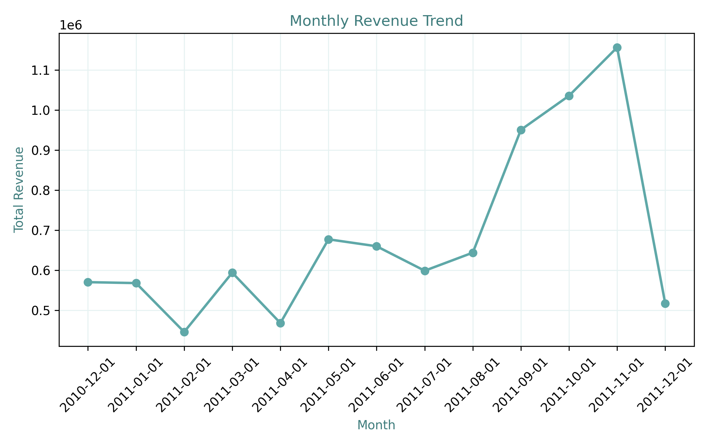
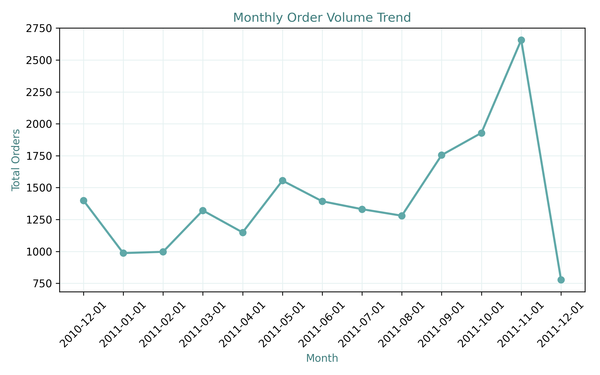
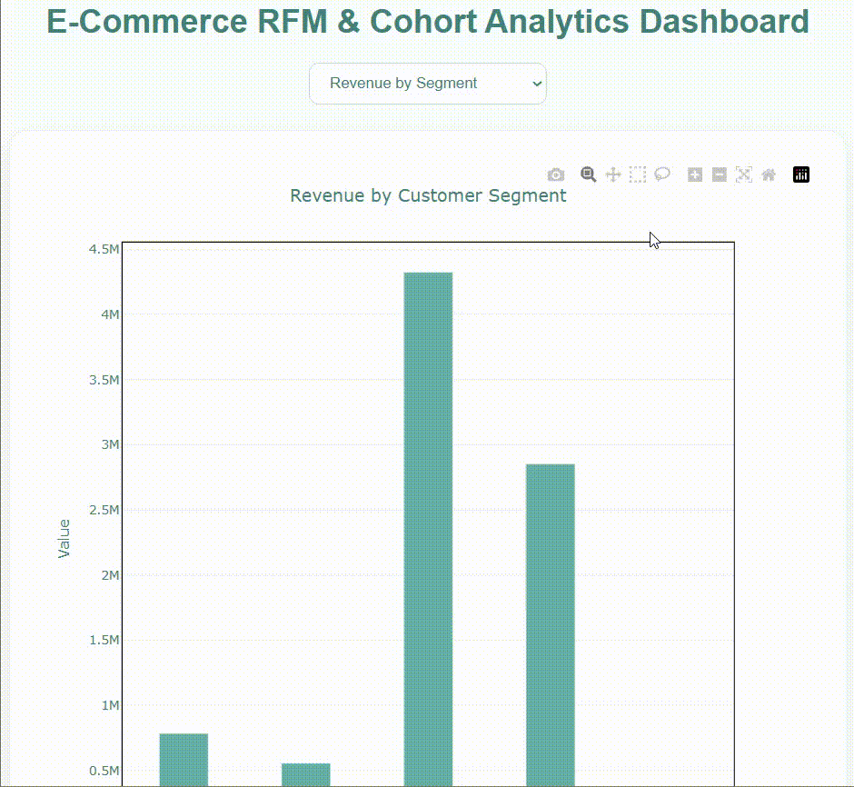

# 🛒 pandas-ecommerce-rfm-cohort-analysis

A **Pandas-based e-commerce customer analytics and segmentation** project.  
The project follows a **layered data pipeline architecture**, separating raw data cleaning, feature engineering, customer segmentation, cohort analysis, and visual storytelling.

This project answers how customer value, retention dynamics, and purchasing behavior evolve over time in an e-commerce business using structured data analytics and interpretable metrics.

---

## 📌 Project Overview

Understanding customer behavior in e-commerce requires more than tracking total sales.  
This project focuses on **how customers purchase over time**, how valuable different customer groups are, and how retention evolves across acquisition cohorts.

The project provides:

- A multi-stage data pipeline (`raw → cleaned → featured → analytics`)
- Customer-level feature engineering (RFM, basket metrics, lifetime metrics)
- Customer segmentation using RFM scoring
- Cohort-based retention analysis
- Revenue and behavioral insights
- Static PNG visualizations and optional interactive dashboards

---

## 📊 Dataset

[Online Retail Dataset](https://www.kaggle.com/datasets/ulrikthygepedersen/online-retail-dataset) contains transactional data from a UK-based online retail company.

**Key fields include:**
- InvoiceNo — Invoice identifier (cancellations start with "C")
- StockCode — Product identifier
- Description — Product description
- Quantity — Number of items purchased
- InvoiceDate — Transaction timestamp
- UnitPrice — Price per item
- CustomerID — Customer identifier
- Country — Customer country

**Data organization:**
- Raw data: `data/raw`
- Cleaned data: `data/cleaned`
- Feature-engineered data: `data/featured`

---

## 📈 Example Outputs

### 🧮 Customer Segmentation
- RFM score distribution  


- Revenue contribution by RFM segment  


---

### 📆 Cohort Analysis
- Monthly customer retention heatmap  


---

### 💰 Sales & Behavioral Insights
- Monthly revenue trend  


- Monthly Order Trend


---
### 🌐 Interactive Dashboard

- Interactive Dashboard Demo



- 🖱️ <a href="https://busracevik.github.io/pandas-global-ecommerce-rfm-cohort-analysis/index.html" target="_blank">View Interactive Dashboard</a>

---

## 🔍 Key Insight: Absence of Champion Segment


Under the current RFM thresholds, no customers were classified as Champions.

This suggests that the customer base is mainly driven by low-frequency and one-time buyers, which is quite common in transactional retail datasets.
Rather than being a modeling issue, this result reflects the natural purchasing behavior observed in the data.

If stricter or looser thresholds are applied, champion-like segments may emerge but the current setup intentionally highlights realistic customer distribution.

---

## 📁 Project Structure

```text
pandas-ecommerce-rfm-cohort-analysis/
│
├── data/
│   ├── raw/                # Original transactional dataset
│   ├── cleaned/            # Cleaned and validated transactions
│   └── featured/           # Customer-level and cohort features
│
├── outputs/
│   ├── tables/                # Aggregated analytical tables
│   └── figures/            # Static visualizations
│
├── docs/
│   ├── index.html          # Interactive dashboard
│   └── demo.gif            # Preview
│
├── src/
│   ├── data_preparation.py
│   ├── feature_engineering.py
│   ├── rfm_analysis.py
│   ├── cohort_analysis.py
│   ├── monthly_metrics.py
│   ├── dashboard.py
│   └── visualization.py
│
├── main.py                 # End-to-end pipeline execution
├── requirements.txt 
└── README.md
```

---

## 🛠 Technologies Used

- **Python** – Core programming language

- **Pandas** – Data preprocessing and analytics

- **NumPy** – Numerical computations

- **Matplotlib** – Static visualizations

- **Plotly** – Interactive dashboards

---

## 🧠 Analytical Approach

This project emphasizes **business interpretability and behavioral understanding** over predictive modeling.  
No machine learning models are used.

Instead, the analysis relies on:

- Transaction-level aggregation  
- Customer-level feature engineering  
- Statistical segmentation  
- Cohort-based retention analysis  

The focus is on answering **business questions**, not forecasting.

---

## 📐 Mathematical Definitions & Business Metrics

Below are the core calculations used throughout the project, along with their mathematical definitions and business interpretations.

---

### Recency

**Definition:**

$$
\text{Recency}_i = (\text{Reference Date} - \text{Last Purchase Date}_i)
$$

**Explanation:**  
Measures how recently a customer made a purchase.  
Lower values indicate more active customers.

---

### Frequency

**Definition:**

$$
\text{Frequency}_i = \text{Number of unique invoices}_i
$$

**Explanation:**  
Measures how often a customer makes purchases.

---

### Monetary Value

**Definition:**

$$
\text{Monetary}_i = \sum_{j=1}^{N} (\text{Quantity}_{ij} \times \text{UnitPrice}_{ij})
$$

**Explanation:**  
Measures total revenue generated by a customer.

---

### RFM Score

Each RFM component is ranked into quantiles and combined into a composite score.

**Definition:**

$$
\text{RFM Score}_i = R_i + F_i + M_i
$$

**Explanation:**  
Higher scores represent more valuable and loyal customers.

---

### Cohort Retention Rate

**Definition:**

$$
\text{Retention}_t = \frac{\text{Active Customers}_t}{\text{Customers in Cohort}_0}
$$

**Explanation:**  
Measures how many customers remain active over time after acquisition.

---

### Average Basket Value

**Definition:**

$$
\text{Average Basket Value} = \frac{\text{Total Revenue}}{\text{Number of Invoices}}
$$

**Explanation:**  
Measures the average monetary value per transaction.
